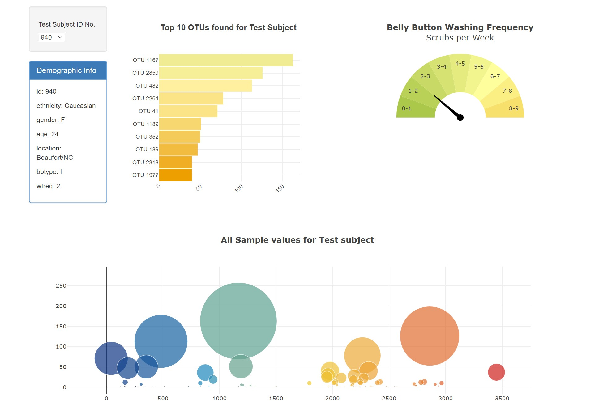
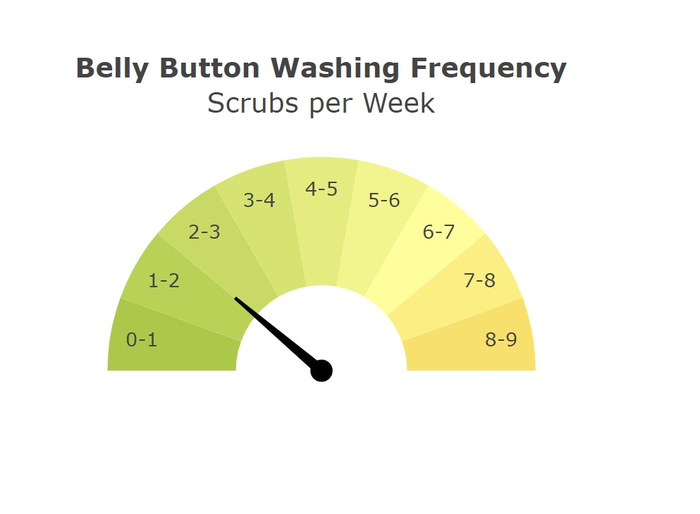

#  Belly Button Biodiversity

An interactive dashboard to explore the [Belly Button Biodiversity dataset](http://robdunnlab.com/projects/belly-button-biodiversity/), which catalogs the microbes that colonize human navels.

The dataset reveals that a small handful of microbial species (also called operational taxonomic units, or OTUs, in the study) were present in more than 70% of people, while the rest were relatively rare.

#### Dashboard : 
https://v-malm.github.io/Plotly_B3/DashBoard/

## Step 1: Plotly

1. Used the D3 library to read in `samples.json`.
2. Created a horizontal bar chart with a dropdown menu to display the top 10 OTUs found in that individual.
    * Used `sample_values` as the values for the bar chart.
    * Used `otu_ids` as the labels for the bar chart.
    * Used `otu_labels` as the hovertext for the chart.
3. Created a bubble chart that displays each sample.
    * Used `otu_ids` for the x values.
    * Used `sample_values` for the y values.
    * Used `sample_values` for the marker size.
    * Used `otu_ids` for the marker colors.
    * Used `otu_labels` for the text values.
4. Displayed the sample metadata, i.e., an individual's demographic information.
5. Displayed each key-value pair from the metadata JSON object .
6. All the plots change the display based on the data for the current sample selection.
    * Layout of the dashboard is shown below:
    

* The Gauge Chart plots the weekly washing frequency of the individual. It is built using  <https://plot.ly/javascript/gauge-charts/> as a guide

    * The needle shows the wash frequecy of selected subject whenever a new sample is selected.
    

    * Reference
        * [Plotly.js documentation](https://plot.ly/javascript/) when building the plots.
        * https://community.plotly.com/t/animations-on-gauge-needle/5804
        * https://stackoverflow.com/questions/53211506/calculating-adjusting-the-needle-in-gauge-chart-plotly-js
        * https://observablehq.com/@arronhunt/building-a-gauge-meter-with-plotly